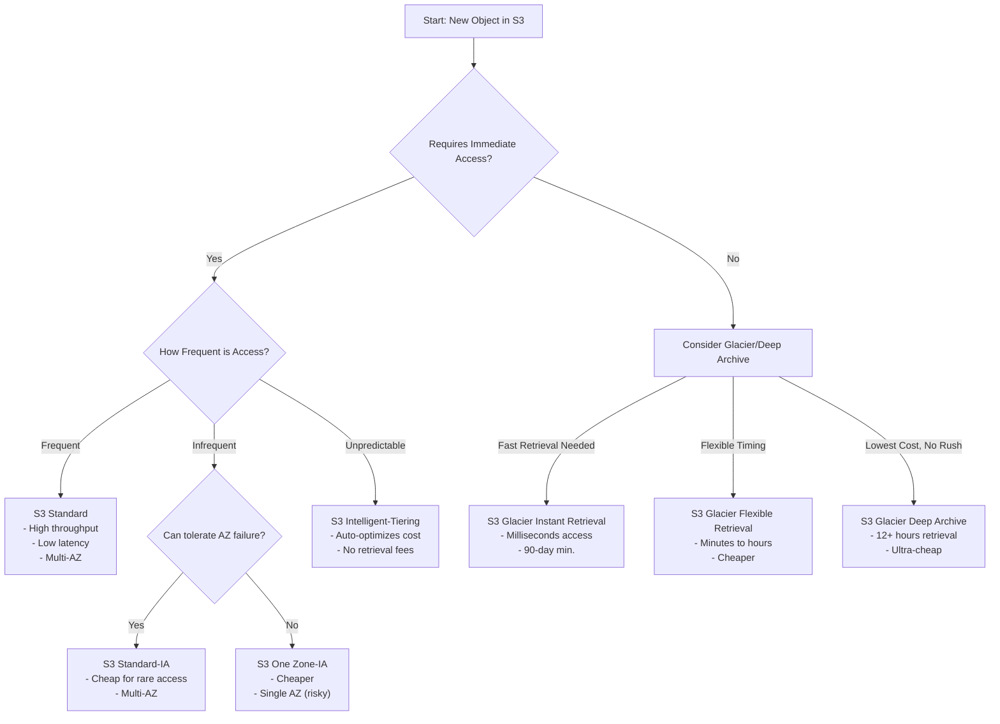

## __Storage Class__

- _S3 Standard (default)_
	- can handle 2 simultaneous AZ failure
	- 99.999999999% durability, 11 9's
	- most expensive
- _S3 Standard-IA_
	- IA - _infrequent access_
	- can handle 2 simultaneous AZ failure
	- 99.999999999% durability, 11 9's
	- on top of egress fee, there is a retrieval fee
	- can end up more expensive than _S3 Standard_ if access too frequently
- _S3 One Zone-IA_
	- IA - _infrequent access_
	- data only in one zone
	- on top of egress fee, there is a retrieval fee
- _S3 Glacier Instant_
	- same performance as _S3 Standard_
	- very cheap storage
	- high retrieval cost
- _S3 Glacier Flexible_
	- very cheap storage, cheaper than _Glacier Instant_
	- high retrieval cost
	- slow retrieval speed
- _S3 Glacier Deep Archive_
	- cheapest storage
	- slowest retrieval speed
- _S3 Intelligent Tiering_

## How to pick

